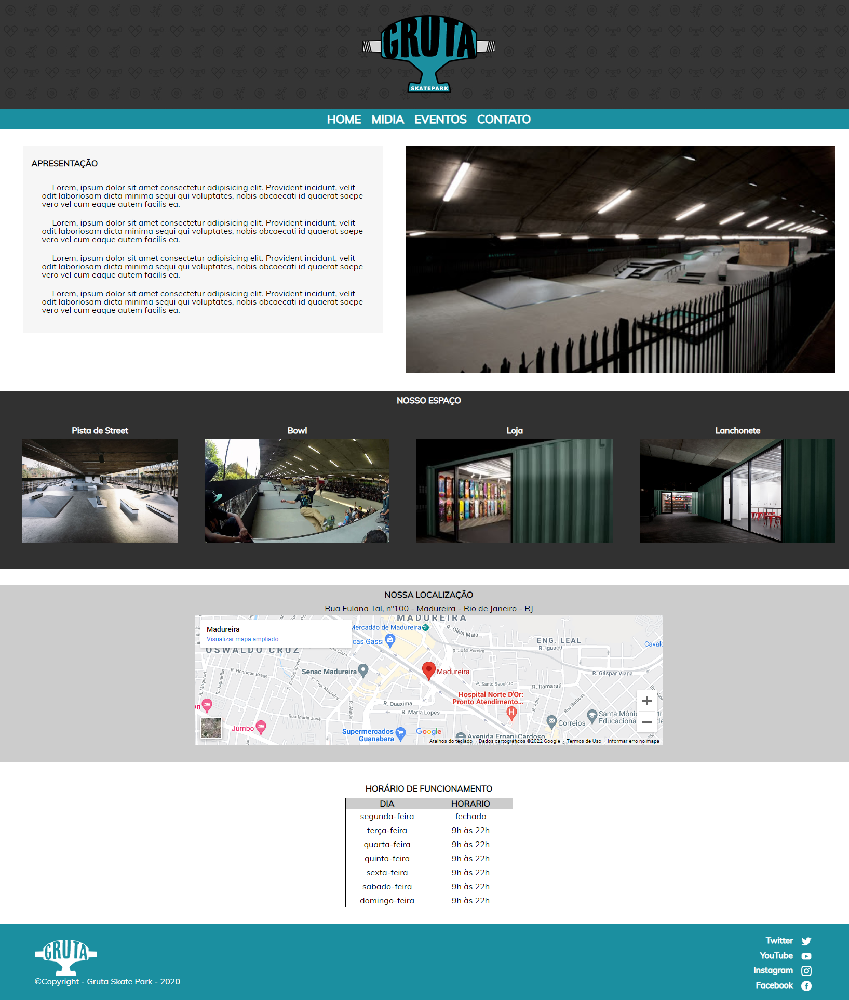
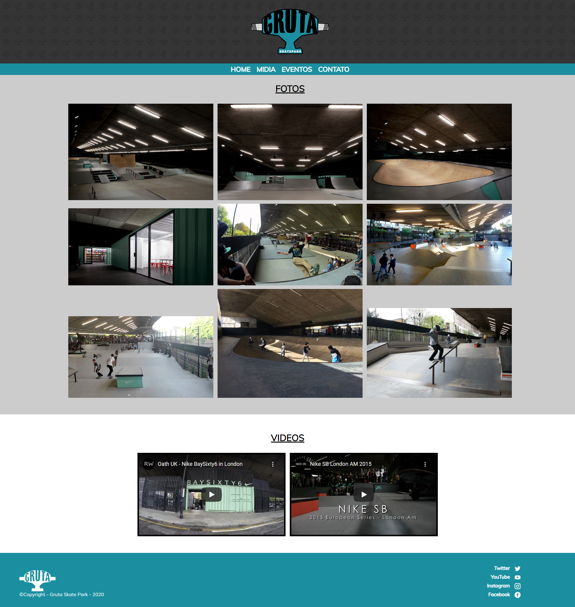
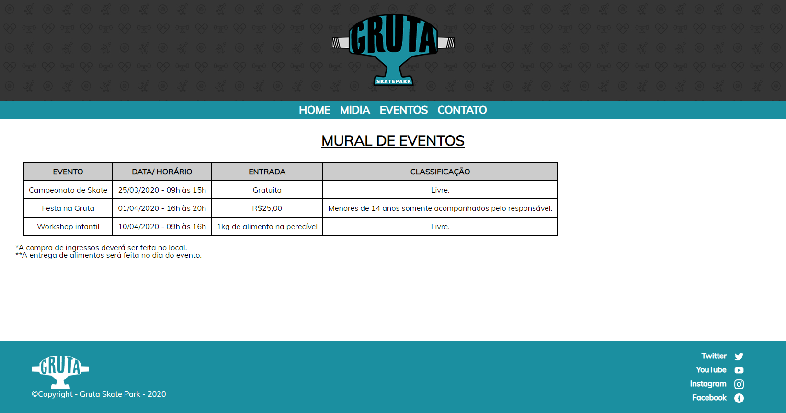
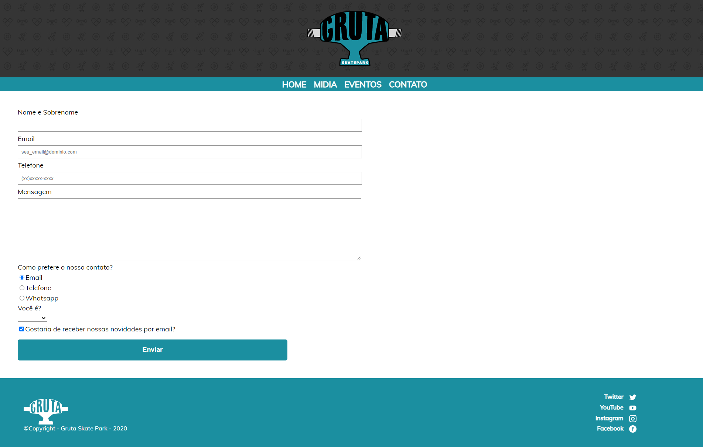
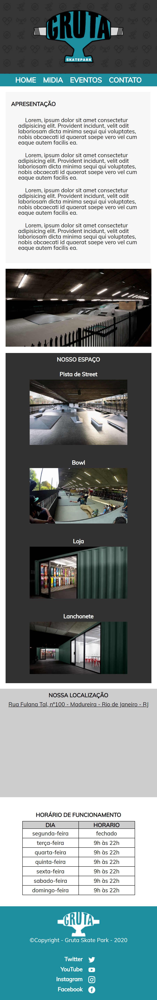
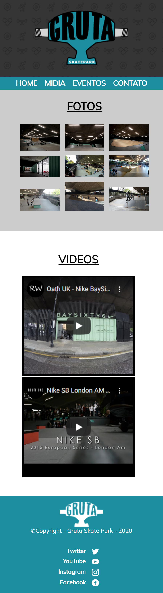
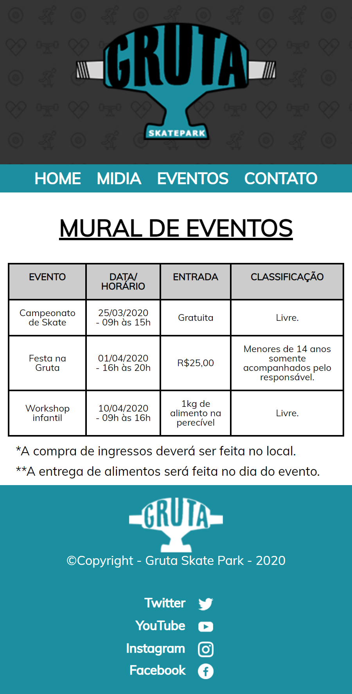
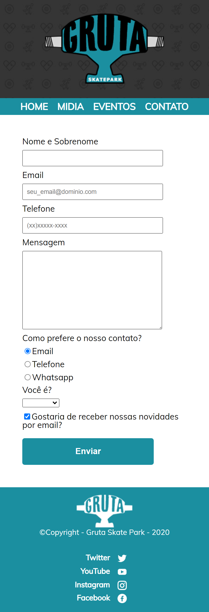

# Gruta-Skate-Park
A simple project using HTML5 and CSS3. 
This project was one of the first that I made during the process of learning Front-end development.

##
### web Page at Vercel platform:

You can access using this link --> [Gruta Skate Park](https://gruta-skate-park.vercel.app/index.html)

## Project screem images:
#### Desktop/ Laptop:
  - Main Page :
  
    
  
  - Media Page :
  
    
 
  - Schedule Page :
  
    
 
  - Form Page :
  
    
  
 #### Mobile:
  
  - Main Page:
  
    
    
  - Media Page :
  
    
    
  - Schedule Page :

    
     
  - Form Page :

    

#### Mobile Demo:
  - Demo:
  
      
